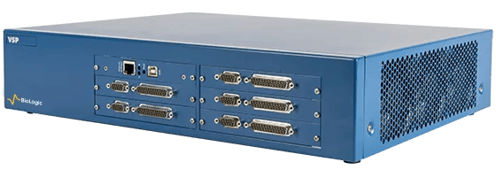
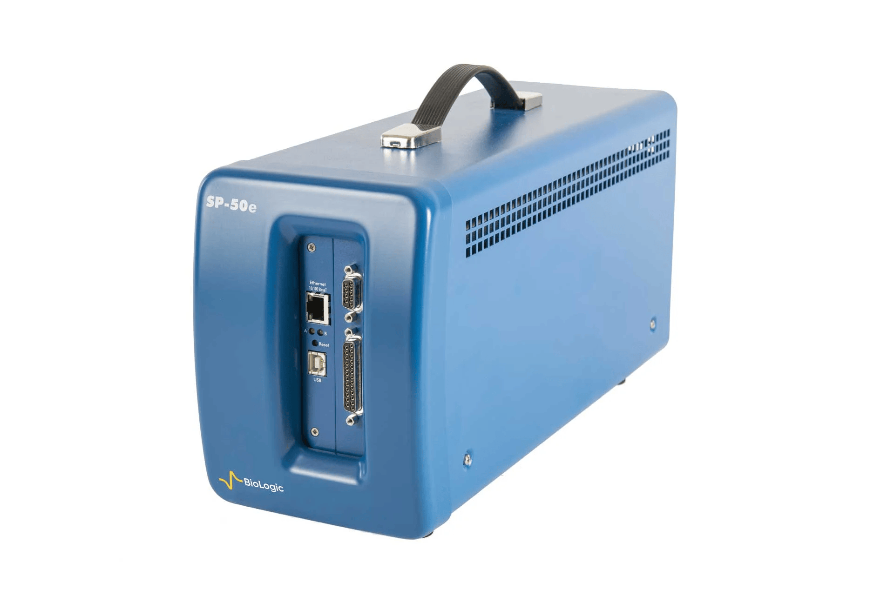
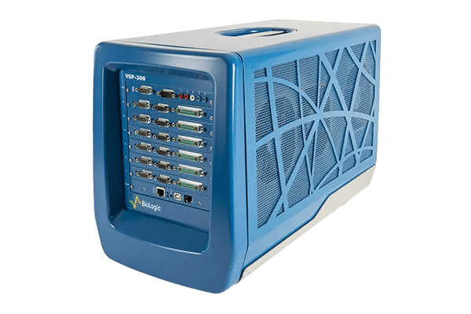
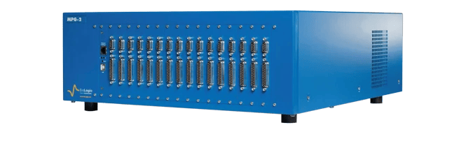

============
Potentiostat
============

A potentiostat is an electronic instrument used in electrochemistry to measure and control the electrical properties of an electrochemical cell (such as a battery, fuel cell, or corrosion cell). A potentiostat can be operated in two modes as outlined below:

* **Potentiostatic mode:** It controls the voltage (potential difference) between a Working Electrode and a Reference Electrode while measuring the resulting electrical current.
* **Galvanostatic mode:** Alternatively, it can control the applied current and measure the resulting voltage response.

**Analogy:** Think of it as a ultra-precise power supply combined with an automated multimeter that can perform complex electrical wave tests (like Cyclic Voltammetry or Electrochemical Impedance Spectroscopy) on test cells.

Our Lab Inventory & Specifications
==================================

Our lab operates several Bio-Logic potentiostats and battery cyclers, located in the battery testing room. Use the table below to identify the right instrument for your specific experimental requirements (e.g., voltage range, current limits, or impedance spectroscopy frequencies):

.. list-table:: Lab Inventory
   :widths: 20 10 25 15 15 25
   :header-rows: 1

   * - Instrument Name
     - Max Channels
     - Voltage Range
     - EIS Frequency Range
     - Current Range
     - Primary Use / Features
   * - VSP Potentiostat
     - 5
     - Customizable (Compliance 20 V, adjustable e.g., 0–20 V)
     - 1 MHz to 10 µHz
     - ±10 µA to ±1 A
     - Multi-channel electrochemical research.
   * - SP-50e Potentiostat
     - 1
     - ±10 V
     - 1 MHz to 10 µHz
     - ±10 µA to ±1 A (6 ranges)
     - Single-channel, automatic current auto-ranging available.
   * - VSP-300 Potentiostat
     - 6
     - Adjustable from ±10 V down to ±30 mV
     - 7 MHz to 10 µHz
     - ±1 A to 10 nA (9 ranges)
     - High-precision low-current and wideband impedance measurements.
   * - MPG-200 Battery Cycler
     - 16
     - ±10 V
     - 10 µHz to 100 kHz
     - ±100 mA
     - High-throughput multi-cell battery cycling and characterization.

Equipment Images
================

   VSP Potentiostat

   SP-50e Potentiostat

   VSP-300 Potentiostat

   MPG-200 Battery Cycler

Best Practices & Standard Operating Rules
=========================================

To prevent costly equipment damage and maintain accurate measurements, all lab members must strictly adhere to the following operational guidelines:

Environment & Cooling
---------------------

* **Do Not Block Ventilation:** Keep all chassis fans and air vents clear of paper, plastic, or obstruction.
* **No Glovebox Placement:** Never place a potentiostat unit inside an inert glovebox. The air-free environment prevents internal cooling fans from dissipating heat. Use hermetic junction cell cables to feed leads into the glovebox instead.
* **Fume Hood Ban:** Do not run potentiostats inside fume hoods exposed to acidic, basic, or organic vapors, as fan circulation will draw corrosive fumes directly into the internal circuitry.

.. note::
   For more comprehensive information—including handling and connection guides, advanced maintenance and troubleshooting procedures, and common mistakes to avoid—please refer to the `potentiostat folder on Box <https://uchicago.box.com/s/02xvzsfnil4s7iie1gtn1pvq54q0dq88>`_.