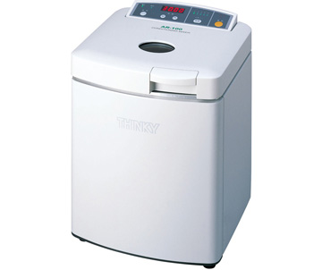
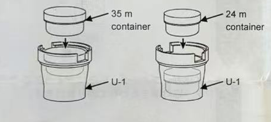
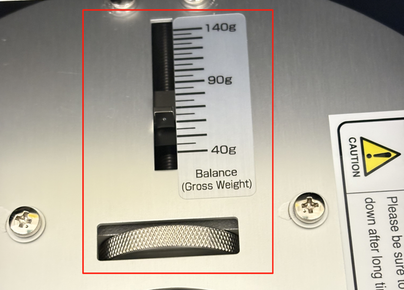
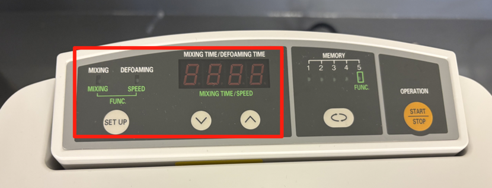

====================
THINKY AR-100 Mixer
====================

This page describes the routine use of the THINKY AR-100 mixer for lab-scale slurry preparation and polymer/material dispersion. It applies to operating the THINKY AR-100 mixer using 24 mL or 35 mL polypropylene (PP) cups with lids and the 100AD-NAN-U adapter.

   THINKY AR-100 Mixer.

1. Safety Guidelines
--------------------

**CRITICAL SAFETY RULES**

* **PPE:** Always wear appropriate PPE, including a lab coat, safety glasses, and gloves.
* **Hazardous Solvents:** Handle NMP-based slurries inside a fume hood.
* **Interlocks:** Do not open the mixer door while the machine is running.
* **Inspection:** Do not use damaged cups, cracked lids, or damaged adapters.
* **Emergency Stop:** Stop the mixer immediately if abnormal vibration, noise, leakage, or errors occur.
* **Duty Cycle:** Do not run the mixer continuously for more than 30 minutes.

2. Materials & Equipment
------------------------

* THINKY AR-100 mixer
* 100AD-NAN-U adapter
* 24 mL or 35 mL PP cup with lid
* Slurry/materials to be mixed
* Milling balls (if required)
* Balance
* Spatula, pipette, or syringe for sample loading

3. Standard Operating Procedure
-------------------------------

Step 1: Sample Loading
~~~~~~~~~~~~~~~~~~~~~~

* Add the slurry or material into a 24 mL or 35 mL PP cup.
* Add milling balls if needed.
* Close the lid tightly.
* Place the closed cup into the U-1 adapter, ensuring it sits flat and does not tilt.

+---------------+-----------------------------------------+----------------------------------------+
| Cup Size      | Recommended Initial Loading Volume      | Maximum Capacity                       |
+===============+=========================================+========================================+
| 24 mL Cup     | ~10–15 mL slurry/material               | 50 mL or 100 g maximum capacity        |
+---------------+-----------------------------------------+----------------------------------------+
| 35 mL Cup     | ~15–25 mL slurry/material               | 50 mL or 100 g maximum capacity        |
+---------------+-----------------------------------------+----------------------------------------+

.. note::
   Do not fill the cup completely, as the slurry can move upward along the cup walls during mixing.

   Cup loading into the U-1 adapter.

Step 2: Weight Balance Setting
~~~~~~~~~~~~~~~~~~~~~~~~~~~~~~

.. warning::
   **Mandatory Step:** The counter-balance must be adjusted before running the mixer to prevent equipment damage.

* Weigh the complete loaded assembly on the balance.
* Ensure the measured gross weight includes:
  
  * 100AD-NAN-U adapter
  * PP cup
  * Lid
  * Slurry/material
  * Milling balls (if used) (Do not use the sample/slurry weight alone).

* Adjust the weight/balance dial (shown in the figure below) inside the mixer to match the measured gross weight.
* **First Run Tuning:** If abnormal vibration or loud noise occurs during the initial run, stop the mixer immediately and slightly adjust the dial to the position with the lowest vibration and noise.

   Weight/balance dial adjustment.

Step 3: Loading into the Mixer
~~~~~~~~~~~~~~~~~~~~~~~~~~~~~~

* Open the mixer door.
* Confirm the weight/balance dial is set to the measured gross weight.
* Insert the loaded adapter into the cup holder.
* Align the bottom holes of the adapter with the two stopper bosses on the bottom of the cup holder.
* Confirm the adapter is seated properly and locked in place.
* Close the mixer door.

Step 4: Mixing Operation
~~~~~~~~~~~~~~~~~~~~~~~~

* Turn on the mixer.
* Set the desired mixing time based on the sample formulation.
* Set the defoaming time if defoaming is required (set to 0 if only mixing is needed).
* Press **START/STOP** to begin operation.
* Observe the mixer during the first run of a new formulation, stopping immediately if abnormal vibration, noise, or leakage occurs.

   Mixer operation control panel.

Step 5: Post-Operation & Cleanup
~~~~~~~~~~~~~~~~~~~~~~~~~~~~~~~~

* Wait until the mixer comes to a complete stop.
* Open the door.
* Remove the adapter and cup assembly.
* Inspect the cup holder and adapter for any leakage or contamination.
* Remove the cup from the adapter.
* Clean the adapter immediately if contaminated.
