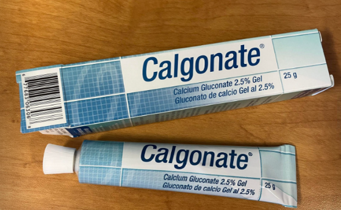

===================================================
Handling Potassium Bifluoride Standard Operating Procedure
===================================================

Potassium Bifluoride (:math:`KHF_2`) poses severe health hazards, notably because it releases highly toxic gaseous hydrogen fluoride (:math:`HF`) when exposed to acids. This SOP outlines mandatory training, handling, storage, and emergency response procedures.

------------------------------------
Training & Access Requirements
------------------------------------

* **Mandatory Training:** Anyone planning to use :math:`KHF_2` must receive dedicated training covering proper handling, specific hazards, and emergency protocols before beginning work.
* **Authorized Trainers:** Training must be conducted by Ke-Hsin.
* **Documentation:** Log all completed training sessions in the Amanchukwu Lab Training Log.

------------------------------------
Operational Precautions & Scale
------------------------------------

* **Reaction Scale:** Limit the use of :math:`KHF_2` to small-scale reactions only.
* **Incompatible Materials:** Prevent all contact with acidic substances. Exposure to acids will liberate dangerous hydrogen fluoride (:math:`HF`) gas.
* **Fume Hood Signage:** Place a highly visible label on the fume hood during use to explicitly inform other lab members that a :math:`KHF_2` operation is in progress.

.. rubric:: Workspace Setup

* Ensure the entire working area and all equipment are completely free from potential acid or water contamination.
* Keep the surrounding workspace explicitly clear of water and acid during operation.

------------------------------------------
Personal Protective Equipment (PPE)
------------------------------------------

* **Standard PPE:** Full standard laboratory PPE is required at all times.
* **Glove Protocol:** It is strongly suggested to double-glove when handling :math:`KHF_2` to provide an extra layer of protection against skin contact.

------------------------------------------
Storage & Environmental Controls
------------------------------------------

* **Desiccator Storage:** Always store :math:`KHF_2` inside the designated desiccator containing an orange moisture indicator.
* **Moisture Monitoring:** Regularly check the indicator color. If the indicator turns green, this signifies the presence of moisture—stop and contact Ke-Hsin immediately.

--------------------------
Waste Management
--------------------------

* **Disposal Location:** Collect all waste stream solutions containing :math:`KHF_2` in the designated fluoride-containing basic liquid waste container, located in the left fume hood.
* **pH Maintenance:** Ensure this specific waste bottle remains under basic conditions at all times to prevent accidental :math:`HF` gas generation.

-------------------------------------
Emergency Exposure Protocol
-------------------------------------

In the event of a suspected or confirmed exposure to :math:`KHF_2`, execute the following protocol immediately:

1. **Remove Clothing:** Immediately strip off all contaminated clothing.
2. **Water Flush:** Thoroughly flush the exposed skin with flowing water for a minimum of 15 minutes.
3. **Apply Antidote:** Generously apply the fluoride-binding agent, Calcium Gluconate Gel (shown in Figure 1).

   Figure 1: Calcium Gluconate Gel

.. rubric:: Gel Locations

Calcium gluconate gel is stocked and accessible at two separate on-site stations:

* Inside the first-aid kit box located in the lab office.
* Directly adjacent to the primary :math:`KHF_2` storage location.