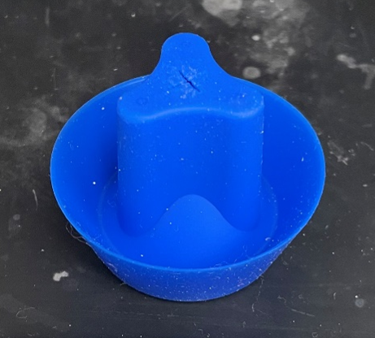
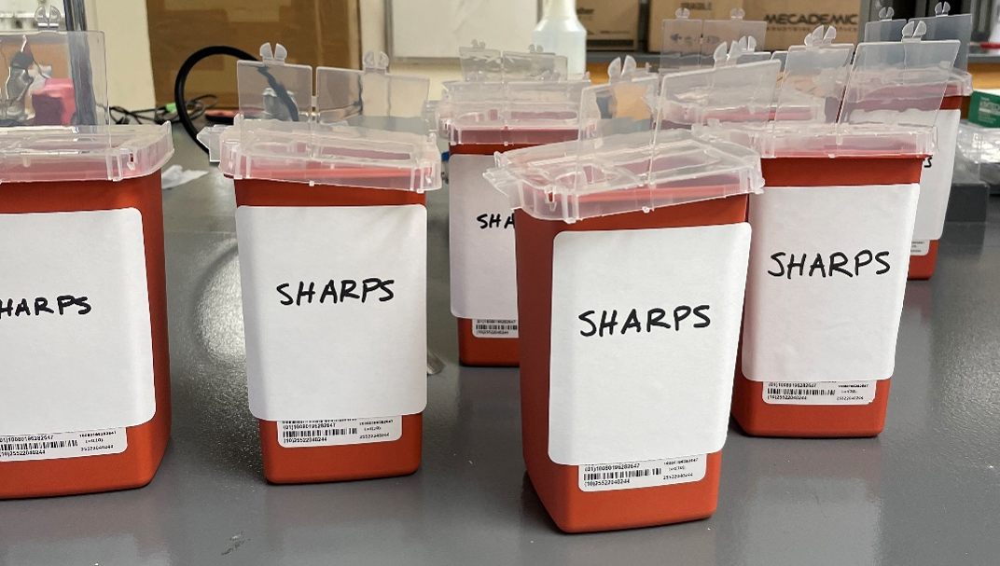

========================================
Needle Usage Standard Operating Procedure
========================================

Needles present a severe risk of accidental skin puncture and chemical injection. This SOP outlines mandatory safe-handling, transportation, and disposal methods, alongside the immediate medical protocols required in the event of a needle prick.

1. Fume Hood & Benchtop Procedures
==================================

Safe Handling
-------------

* **Caution During Insertion:** Always open needles and insert them through septums with extreme caution. The risk of a slip or puncture is highest when pushing or extracting a needle through tough materials; practice patience and steady force.
* **Immediate Disposal:** When a procedure is complete, immediately throw away uncapped needles into the nearest designated sharps container to eliminate the risk of loose needles in the workspace.
* **Mandatory Transportation Rule:** Never walk between separate workspaces or to a balance with an uncapped needle. If you must transport a syringe, you must cap it first using one of the two approved methods below.

Approved Recapping Methods
--------------------------

.. warning::
   CRITICAL: Never hold a needle cap in one hand while driving the needle toward it with the other.

* **Method 1 (One-Handed Scoop):** Place the needle cap flat on the floor of the workspace. Carefully slide the needle into the cap without touching the cap with your hands. Once the needle is fully inside the sleeve, use your hands to tightly fasten the cap onto the needle base.
* **Method 2 (Capping Assistant):** Place the needle cap securely inside the custom physical holder station. Slide the needle straight down into the stationary cap and push firmly to secure it.

   Capping assistant for safe, single-handed needle recapping.

Disposal
--------

* **Proximity:** Sharps containers are positioned inside each fume hood and on every benchtop. Always dispose of needles in the immediate receptacle where you are working.
* **Emptying Protocol:** When a hood or benchtop sharps container becomes halfway full, empty it directly into the large lab sharps collection container.

   Sharps containers for safe disposal of used needles.

2. Glovebox Procedures
======================

Safe Handling
-------------

* **Dexterity Limitations:** Exercise heightened patience when manipulating needles inside the glovebox. The thick, triple-layer glove configuration severely reduces finger dexterity and increases the likelihood of an accidental prick.
* **Mandatory Capping:** Because waste needles cannot remain permanently in the glovebox and must be brought outside for disposal, always cap needles immediately after use to ensure safety during chamber transit and cleanup. Use either the "one-handed scoop" or the glovebox capping assistant station.

Removal and Disposal
--------------------

* **Transit Preparation:** Double-check that all needles are tightly and securely capped before transferring them out through the antechamber. This minimizes puncture risks for the person collecting the waste.
* **Final Disposal:** Once extracted from the glovebox, immediately drop the capped sharps into one of the designated fume hood sharps containers.

3. Contaminated Needle Prick Emergency Protocol
===============================================

If your skin is punctured by a needle, execute the following emergency steps immediately:

First Aid
---------

Wash the punctured area thoroughly with soap and water. Apply direct physical pressure and continuously rinse the wound with water until the bleeding stops. Dry the skin and apply a clean bandage.

Evaluate Toxicity
-----------------

If the needle was contaminated with toxic chemicals, **bypass general monitoring and proceed immediately to the Emergency Room (ER).**

.. raw:: html
   <iframe src="https://www.google.com/maps/embed?pb=!1m16!1m12!1m3!1d1040.1183291987586!2d-87.60538498431389!3d41.791490485947165!2m3!1f0!2f0!3f0!3m2!1i1024!2i768!4f13.1!2m1!1suchicago%20hospital%20emergency%20room!5e0!3m2!1sen!2sus!4v1783857099116!5m2!1sen!2sus" width="600" height="450" style="border:0;" allowfullscreen="" loading="lazy" referrerpolicy="strict-origin-when-cross-origin"></iframe>

Contact the Experts
-------------------

For both toxic and non-toxic chemical exposures, immediately call either of the following helplines:

* **Needle Stick Hotline:** 773-753-1880 (Pager: 9990#)
* **Poison Control:** 1-800-222-1222

Be Ready to Provide
-------------------

Have the following specific details prepared for medical personnel:

* The exact time the accident occurred.
* An estimate of the volume of material remaining on the needle (typically assumed to be $\le 10\text{ }\mu\text{L}$).
* The precise names of all chemicals present on or inside the needle (including all solutes dissolved in your carrier solvent).

Reporting
---------

Once out of danger and any required ER monitoring is complete, notify Chibueze and the Lab Safety Officer immediately. You must fill out both the internal `Lab Incident Form <https://docs.google.com/forms/d/1KrQuKVNyGaYBey4l05DB1_VSlm2gcubvD_mPGtlafs4/prefill?authuser=1>`_ and the official university `UCAIR Incident Form <https://ucair.uchicago.edu/>`_.